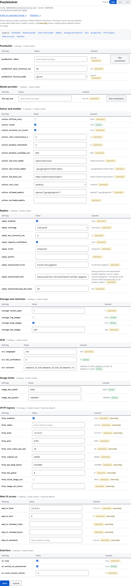
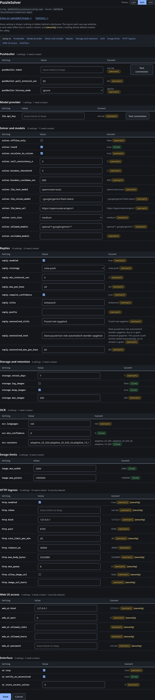

# Configuration reference

The [README](../README.md#configure-it) covers the common path: where the file lives, that a
missing file is normal, and how the secrets are supplied. This page is the full reference.

## The file

`%APPDATA%\PuzzleSolver\config.toml` on Windows, or
`${XDG_CONFIG_HOME:-~/.config}/PuzzleSolver/config.toml` elsewhere; `--config <path>`
(or `$PUZZLESOLVER_CONFIG`) overrides it. An unknown key warns and is ignored; a *bad*
value (wrong type, unknown enum, negative interval) fails loudly and names the key.

`DEFAULTS` in [`src/config.js`](../src/config.js) is the full schema; `DESIGN.md` §4.13
explains the defaults.

The installer writes a commented example beside it, `config.toml.example`, in the same
directory. It is generated from `DEFAULTS` and the settings registry, every line is
commented out, and it is never read: it is a discovery aid, not a live file, so copying
it over `config.toml` pins no default (a complete live file would freeze this version's
defaults and later releases would silently not apply). The settings editor can change
the same keys, and the secrets it must not carry are described under
[Secrets](#secrets-go-in-the-credential-store-or-in-the-environment) below.

## Every `config.toml` key, with its default

This is **every key that can live in `config.toml`**, with its default. The three
secret-shaped settings (`pushbullet.token`, `llm.api_key`, `http.token`) and
`web_ui.password` are not config keys and live in the credential store — see
[Secrets](#secrets-go-in-the-credential-store-or-in-the-environment) below.

```toml
[pushbullet]
poll_interval_sec = 60          # the stream is primary; this is the fallback poll
history_mode = "ignore"         # "ignore" pre-existing pushes, or "watermark"
[solver]
tier0 = true                    # offline lexicon + arithmetic
offline_only = false            # true = never call a model; no image leaves the machine
escalate_to_vision = true
llm_text_model = "gpt-4o-mini"
llm_vision_model = "gpt-4o"
llm_base_url = "https://api.openai.com/v1"
self_consistency_n = 3          # samples for the voting classes (ordinal-pick, unknown)
breaker_threshold = 3           # consecutive model failures before a tier is skipped
breaker_cooldown_sec = 600
cost_tier = ""                  # auto-router band; "" sends none (see openrouter.md)
allowed_models = []             # auto-router allowlist, wildcards; [] = no restriction
excluded_models = []            # auto-router denylist, wildcards
[ocr]
languages = ["nld"]             # restart-bound; only installed @tesseract.js-data/<lang> packages work
min_confidence = 0              # drop a transcript below this Tesseract confidence (live)
variants = ["adaptive_25_020", "adaptive_25_020_c8", "adaptive_15_020"]  # preprocessing runs (live)
[reply]
enabled = true
strategy = "note-push"          # note-push | sms-thread | clipboard+notify
require_confidence = true       # only send answers every tier agreed on
title = "Antwoord"
prefix = ""                     # optional text before every answer
unresolved_title = "Puzzel niet opgelost"
unresolved_text = """
Deze puzzel kon niet automatisch worden opgelost, dus er is geen antwoord gegeven.
This puzzle could not be solved automatically, so no answer is given."""
min_interval_sec = 3
max_per_hour = 20               # answers per hour
unresolved_max_per_hour = 60    # acknowledgements have their own, looser budget (#48)
[storage]
retain_days = 7
log_images = false              # opt-in reference to an UNRESOLVED image only
keep_images = false             # opt-in bounded review copy of EVERY solve's image
max_images = 200                # count cap when keep_images = true (age = retain_days)
[ui]
tray = true                     # show the tray icon in desktop mode
notify_on_unresolved = true     # desktop notification for a puzzle left unresolved
stats_recent_solves = 5         # recent solves listed on the statistics page
[image]
max_width = 2000                # the shared gate rejects wider images as a 413
max_pixels = 1000000            # ~14x the largest corpus puzzle; bounds buildVariants
[http]
enabled = false                 # an HTTP endpoint that solves captchas is an oracle
bind = "127.0.0.1"             # never 0.0.0.0 unless you mean it; it warns if you do
port = 8765
rate_limit_per_min = 20         # 0 disables the limit
timeout_ms = 30000      # a solve past this is a 504; nothing is sent
max_body_bytes = 5242880        # 5 MiB, the same cap as a Pushbullet image
max_queue = 8                   # requests running/waiting at once; over this is a 503
allow_image_url = false         # off: image_url makes the server fetch a caller URL (SSRF)
image_url_hosts = []            # when on: the only hosts image_url may name (default deny)
[web_ui]
bind = "127.0.0.1"             # loopback only; read remote-access.md before widening
port = 0                        # 0 = ephemeral, loopback only; set for remote access
allowed_cidrs = []              # blank = loopback only; a non-loopback range needs web_ui.password
allowed_hosts = []              # extra Host names; default deny
```

There is **no `web_ui.enabled` key.** The web UI has no on/off switch, and `http.enabled`
controls the [HTTP solve endpoint](./http-api.md) only — the two are separate
servers with separate bind, port and credential (see
[the web UI](../README.md#the-web-ui) and
[Exposing the web UI beyond loopback](./remote-access.md)). The UI is started on demand
by the tray's **Settings** item or `node src/cli.js config edit --gui`, and closes when
the session ends; the automatic first-run prompt is tray-only. `web_ui.password` is a
secret, not a config key, and gates a non-loopback bind (the option list above stops at
the keys that can live in `config.toml`).

## Stored review copies

With `keep_images = true` the app keeps a **bounded WebP copy** of every solve's image
(longest edge 512 px, re-encoded, not the original bytes) so the recent-solves page can
show what was solved. It is **off by default**, like every other setting that retains or
exposes data. The copies are pruned by the same `storage.retain_days` window and by
`storage.max_images` (default 200, newest kept); `node src/cli.js images purge` deletes
all of them on demand. On POSIX the images directory is mode `0700` and the files `0600`;
on Windows `chmod` does nothing, so there the files are protected only by the per-user
profile ACL — they are **not encrypted**. The thumbnail is served through the same
access-gated web route as the statistics page.

## Secrets go in the credential store, or in the environment

The Pushbullet token, the model key and the HTTP bearer token are **not** config keys. A
config key whose name looks like a secret (`*token*`, `*key*`, `*secret*`, `*password*`)
is rejected at load, because a config file ends up in backups and support threads.

On a normal install the app collects them for you: the first-run setup page (the
Pushbullet token and model key), or the tray's **Settings** editor, writes them to the
credential store. On Linux/macOS that is
the file at `${XDG_CONFIG_HOME:-~/.config}/puzzlesolver/credentials.json`; on Windows it
is the DPAPI-protected blob at `%APPDATA%\PuzzleSolver\credentials.dpapi`. A hand-written
plaintext `%APPDATA%\PuzzleSolver\credentials.json` is still read once, migrated to DPAPI
and removed on the next start; that path exists for migration, not as the way to populate
the store.

A headless or unattended run reads them from the environment instead. It must be a
**persistent** variable — `setx`, or System Properties → Environment Variables — because
the app started at logon does not see a session `$env:` assignment:

```powershell
setx PUSHBULLET_TOKEN "o.xxxxxxxx"
setx LLM_API_KEY       "sk-xxxxxxxx"
```

The Pushbullet token is required *unless* the HTTP ingress is enabled, in which case
the app can run without a Pushbullet account at all. In tray mode a missing Pushbullet
token opens the first-run prompt (token, optional model key, **Test connection**) and
stores what you enter in the credential store; cancel it and nothing starts.
`--headless` has no prompt, so a missing token exits non-zero naming both
`PUSHBULLET_TOKEN` and the credential-store file. The model key is optional: with none,
the app runs offline-only (Tier 0).

When `[http] enabled = true`, another required secret is the bearer token for the HTTP
endpoint. Like the other two it goes in the credential store — the settings editor's
**HTTP bearer token** row, or `node src/cli.js config set http.token a-long-random-string`.
An unattended run may set `HTTP_AUTH_TOKEN` in the environment instead, but that variable
must be **persistent** (`setx` or System Properties, as above), not a session `$env:`
assignment, or the app started at logon will not see it. A legacy hand-written
`credentials.json` with `http_auth_token` is still read once and migrated to DPAPI on the
next start on Windows — that path exists for migration, not as the way to set the token.

There is **no anonymous mode**: with `enabled = true` and no token the service refuses
to start rather than listen unprotected. The token must be at least 16 characters and
not an obvious weak value (a short or dictionary token is rejected at startup, because
a guessable key on a bound endpoint is an oracle). Generate one with
`openssl rand -hex 24`.

## How the secrets are protected

**On Windows the secrets are DPAPI-protected.** `src/secrets.js` writes them through
`[System.Security.Cryptography.ProtectedData]::Protect(..., 'CurrentUser')`, reached via the
PowerShell that ships with Windows, so there is no npm dependency and no separate key to
manage. A pre-existing plaintext `credentials.json` is read once, migrated and removed. If the
protected call cannot be made, the app still starts on the file store and **says which store it
used** — `config list` reports the source (`windows-dpapi` vs `file`) and the startup log names
the chain. The round trip is executed on a real `windows-latest` runner by the deploy job
(`packaging/run-dpapi.ps1`): one `node` process migrates and writes, then a **second, fresh
process** decrypts the file from disk and asserts that `Unprotect` ran. The two processes are the
point — a single process could return the value from its in-memory cache, and the check would pass
with DPAPI never being called (issue #83).

**What DPAPI does and does not protect.** At `CurrentUser` scope the blob is readable only by
this account on this machine, and a copy taken elsewhere (a backup, a profile copy, another
machine) cannot be decrypted. It does **not** protect against malware running as the same user:
any process running as you can ask the OS to unprotect it. It raises the bar from "a readable
plaintext file in your profile" to "the OS keyed to your account"; it is not a defence against a
compromised account.

## Change a setting with the editor

The tray's **Settings** item opens an editor that lists the current values, validates
every change, and routes it to the right store. On a desktop session it opens as a
**loopback web UI in the default browser** (`config edit --gui` opens the same UI from a
console); this is what makes configuration possible on the shipped Windows install, where
the tray runs with the window hidden and has no console for a terminal prompt. The web UI
binds `127.0.0.1` on an ephemeral port (`web_ui.port`, default `0`; set it for remote
access — see [Exposing the web UI beyond loopback](./remote-access.md)), requires a
single-use link token, validates the `Host` header, serves every response with
`Cache-Control: no-store`, never renders a secret value, and closes its listener when you
save or cancel. It is themed by a cookie and a server-side render, so an OS-dark visitor
is dark on the first load and the **Light / Dark / Auto** toggle works with JavaScript
disabled; every page shares the same frame. `--headless` has the same editor
behind a command, so an unattended machine is not a second-class mode:

```bash
node src/cli.js config list                  # every editable setting and its current value
node src/cli.js config get reply.title
node src/cli.js config set solver.offline_only true
node src/cli.js config edit                  # the guided editor over stdin
node src/cli.js config edit --gui            # the same editor as a loopback web UI
```





The ~50 rows are grouped by **topic** (the setting's `id` prefix) with a **Jump to** list
of section anchors, because that is how someone actually finds one — a lifecycle split
would make you hunt through two lists for "the reply text". Nothing is hidden behind a
disclosure: every row is still on the page. Each row keeps its `[live]` / `[restart]`
tag and the `[security]` marker, and each group's header counts how many of its rows
need a restart, so the lifecycle information is not lost to the grouping.

Secrets go to the credential store, never to `config.toml`. That covers all four of
them: `config set pushbullet.token o.xxxxxxxx`, `config set llm.api_key sk-xxxxxxxx`,
`config set http.token a-long-random-enough-token` and `config set web_ui.password
<passphrase>` each write the credential store (the DPAPI
blob on Windows, `credentials.json` elsewhere) and leave
the TOML file alone (or uncreated). A write **re-reads the store immediately before merging**
(read-modify-write), so a `config set` from a second process while the tray service is running is
not wiped by the service's next save (issue #84). Residual: two writers racing at the same instant
still have a last-writer-wins window; that is narrow and documented rather than closed with a lock. The HTTP token is checked against the same strength
rule the server enforces at startup, so the editor cannot store a token the app then
refuses to start with. Everything else is checked with the same `validateConfig` the
loader uses, then written **atomically** — a temp file renamed over the old one, with the
previous file kept as `config.toml.bak`. Only values that differ from the built-in
defaults are written, so the file stays an override rather than pinning every default. A
save **edits the file in place**: it changes only the line for the setting you changed and
leaves every comment, blank line, key order and spacing exactly as it was, so a
hand-annotated `config.toml` is safe to keep editing by hand. A value the editor cannot
locate safely — a value spanning more than one line, an array of tables — is refused with
the reason and the file is left untouched, never silently rewritten. A rejected value
names the setting and writes nothing at all, so the editor cannot leave a config that
stops the app from starting.

The editor covers the HTTP ingress too — `http.enabled`, `http.bind`, `http.port`,
`http.rate_limit_per_min`, `http.timeout_ms`, `http.max_body_bytes`, `http.max_queue`,
`http.allow_image_url`, `http.image_url_hosts` and
`http.token` — so enabling the endpoint no longer means hand-editing TOML **and** writing
the credential by some other route.

## Some settings need a restart

The editor marks each one `[live]` or `[restart]`, and the headless command prints which
applies:

- **live** — `storage.log_images`, `storage.keep_images`, `ui.notify_on_unresolved`,
  `solver.tier0`, `ocr.variants`, `ocr.min_confidence`, `image.max_width` and
  `image.max_pixels`. These
  are re-read from the shared config object for every solve, push or HTTP request, so a
  save takes effect without a restart.
- **restart** — `solver.offline_only`, `solver.escalate_to_vision`,
  `solver.self_consistency_n`, the breaker knobs (`solver.breaker_threshold`,
  `solver.breaker_cooldown_sec`), the model settings and base URL
  (`solver.llm_text_model`, `solver.llm_vision_model`, `solver.llm_base_url`), the
  auto-router policy (`solver.cost_tier`, `solver.allowed_models`,
  `solver.excluded_models`), the reply switch, wording and budgets (`reply.*`),
  `pushbullet.poll_interval_sec`, `pushbullet.history_mode`, `ocr.languages`,
  `storage.retain_days`, `storage.max_images`, `ui.tray`, `ui.stats_recent_solves`, the
  whole `http.*` and `web_ui.*` blocks, and **all four secrets** (`pushbullet.token`,
  `llm.api_key`, `http.token`, `web_ui.password`),
  because the listener, reasoner, responder or HTTP server capture them when they are
  built. The running service keeps the old value until it is restarted; the editor says
  so rather than appearing to save something that does nothing.

`ocr.languages` is restart-bound even though it sits next to `ocr.min_confidence`: the
Tesseract worker is created once at startup from this list. Each language must have its
traineddata **installed** as an `@tesseract.js-data/<lang>` package — the app never
downloads it at runtime — so only the bundled `nld` works out of the box. A configured
language with no installed data is refused **by name** when the config is loaded and again
when the worker is built; it is never silently read as `nld`.
