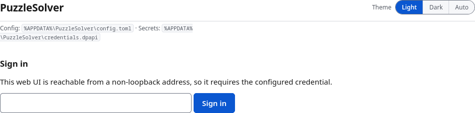

# Exposing the web UI beyond loopback (read this before doing it)

By default the web UI binds `127.0.0.1` and only loopback may reach it. That is the
recommended setting. If you genuinely need it from another machine, two things must be
configured together, in `config.toml`:

```toml
[web_ui]
bind = "0.0.0.0"                 # or a specific LAN address
port = 8443                      # required for remote access; 0 = ephemeral (loopback only)
allowed_cidrs = ["192.168.1.0/24"]
allowed_hosts = ["puzzle.lan"]    # every Host name you will type, default deny
```

The access rule is a **single control for every page** (settings and solve alike): the
socket's remote address must be loopback or fall inside one of `allowed_cidrs`.
`X-Forwarded-For` is ignored — it is caller-supplied. Any set of ranges that **together**
covers the whole IPv4 or IPv6 address space is refused at load, not only the literal
`0.0.0.0/0`/`::/0`: `0.0.0.0/1` plus `128.0.0.0/1` is refused too. That refusal is a guard
against "reachable from everywhere", not a width ceiling — a single wide-but-partial range
is allowed, because the credential below is what actually protects the UI. If the UI must be
reachable from everywhere, put it behind your own authenticated reverse proxy.

**Remote access needs a stable port.** `web_ui.port` defaults to `0`, which lets the OS pick
an ephemeral port — correct for the loopback case, where the app opens the URL itself. A
non-loopback range with `port = 0` is refused at server start with an error naming
`web_ui.port`, because a remote client or a reverse proxy has no stable port to reach.

## A non-loopback range requires a credential

Set it once with

```bash
node src/cli.js config set web_ui.password 'a long passphrase'
node src/cli.js config edit --gui        # or set it in the Settings page
```

That stores a **salt + `scrypt` verifier** in the credential store (`credentials.json`, or the
DPAPI blob on Windows — never the password,
never `config.toml`); a non-loopback client must sign in, and failed logins are
throttled. With a non-loopback range and no credential the service **refuses to start**,
naming `web_ui.password`, rather than listen unauthenticated.



## This is plain HTTP

A password sent over a non-loopback connection travels in
cleartext, and the session token cannot be marked `Secure`. The credential raises the bar
against someone casually browsing the LAN; it does **not** make an untrusted network
safe, and it is not a substitute for transport encryption. For access from anywhere you
do not fully control, terminate TLS at a reverse proxy and reach the UI through that.
Set `web_ui.port` to the fixed port the proxy forwards to, and list the public **name** the
proxy sends in `Host` (for example `ui.example.com`) in `allowed_hosts`. The `Host` check
compares the name, not the port, so the proxy's `Host: ui.example.com` or
`ui.example.com:443` is accepted even though it connects to a different internal port. The
proxy's own address must be in `allowed_cidrs` (a proxy on the same host is loopback and is
always allowed).
