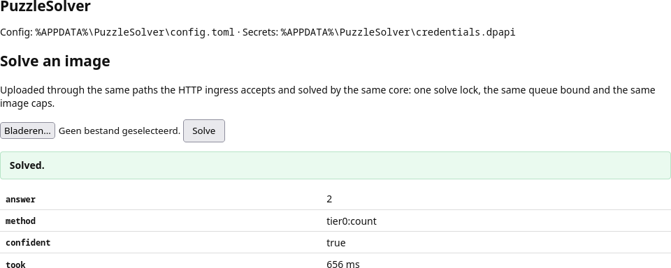

# Solve an uploaded image in the web UI

The same web UI has a **Solve an uploaded image** page. It is not a second solve path:
the upload goes through the HTTP ingress's own `classifyRequest`/`resolveImage` (a raw
body, a `multipart/form-data` file or a base64 body), and the solve runs on the same
shared core, so the one solve lock, the queue bound (`http.max_queue`) and the image caps
(`http.max_body_bytes`, `image.max_width`, `image.max_pixels`) all apply. The result
shows the **answer**, the **method** (`tier0`, `model:text` or `model:vision`),
**confidence** and **how long it took** — the same fields the HTTP response carries,
because it is the same serialiser. An unresolved puzzle shows the configured
acknowledgement text; a guess is never displayed.

The page is reached through the web UI described in the [README](../README.md#the-web-ui)
and in [Exposing the web UI beyond loopback](./remote-access.md).
