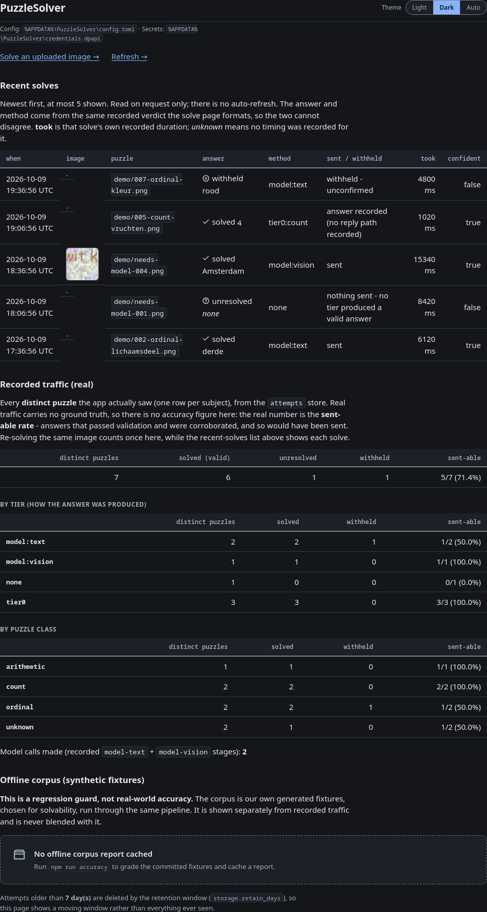

# The statistics page

The same web UI has a read-only **Statistics** page (no form and no POST target, so a
write is unreachable from it). It lists the most recent recorded solves, bounded by
`ui.stats_recent_solves` (default 5), with the same answer, method, confidence and
delivery verdict the solve page shows, because both render through the same serialiser.
Its **took** column is that individual solve's own recorded duration (from the start of
the solve to its `validate` row); a row with no recorded timing shows **unknown** rather
than a fabricated figure. The **Recorded traffic** totals below it count **distinct
puzzles** — re-solving the same image counts once there, while the recent-solves list
above shows each solve separately. Recorded traffic (real, with no ground truth) and the
offline corpus (our own fixtures) are two separate, labelled figures and are never
blended; the corpus is called a regression guard, not real-world accuracy.

The page is reached through the web UI described in the [README](../README.md#the-web-ui)
and in [Exposing the web UI beyond loopback](./remote-access.md).
